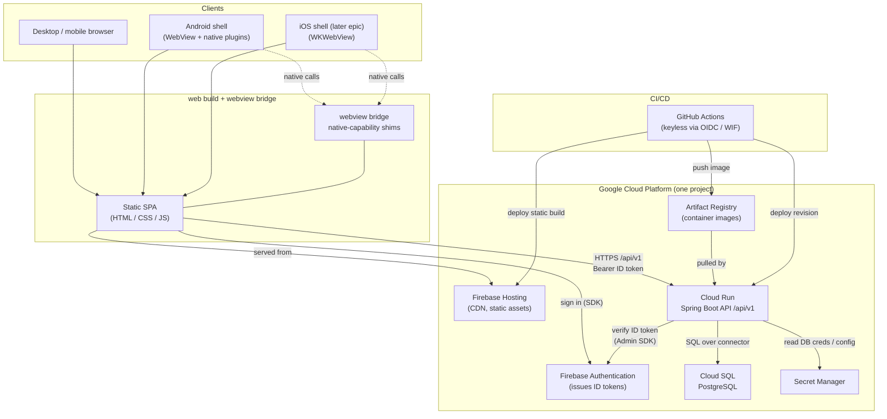

<!--
  ARCHITECTURE.md — the system-level map of OpenSkeleton (osk1).

  Purpose: give a maintainer who did not build this repo a single place to see
  how the surfaces (backend, web, webview, android) fit together, where they run
  in GCP, and how a request and its authentication flow end to end. Per-surface
  detail lives in each directory's README and the design decisions in docs/adr/;
  this file is the connective tissue between them. Keep it in sync when a surface
  or a boundary changes.
-->

# Architecture

OpenSkeleton is a **multi-surface application skeleton**: one backend API, one
web build, and native shells that reuse that same web build. This document maps
the surfaces, where they run, and how a request flows.

For the reasoning behind these choices, see the decision records:

- [ADR-0001 — Cloud SQL for PostgreSQL](docs/adr/0001-database-cloud-sql.md)
- [ADR-0002 — Cloud Run + Firebase Hosting, keyless deploy](docs/adr/0002-hosting-cloud-run-firebase.md)
- [ADR-0003 — Firebase Authentication](docs/adr/0003-auth-firebase.md)

## Surfaces

| Surface | What it is | Runtime |
| --- | --- | --- |
| **`backend`** | Java + Spring Boot REST API under `/api/v1` plus actuator probes (`/health`, `/info`, `/metrics`). Owns domain logic and persistence. | Container image on **Cloud Run**. |
| **`web`** | Static single-page build (HTML/CSS/JS). The one UI, served to browsers and reused inside the mobile shells. | Static assets on **Firebase Hosting** (CDN); an **nginx** container image gives local/container parity. |
| **`webview`** | The shared WebView bridge contract — the "I am running inside a WebView" signal and native-capability shims — so the *same* web build runs unmodified in Android's `WebView` and iOS's `WKWebView`. | Ships inside the web build + the native shells; no server of its own. |
| **`android`** | Thin native shell wrapping the web build in a `WebView` (Capacitor-style hybrid), exposing native capabilities (push, GPS, camera, biometrics) through the `webview` bridge. | Android app package on the device. |
| **`infra`** | Infrastructure-as-code: GCP project, Cloud Run, Firebase Hosting, Cloud SQL, Artifact Registry, Secret Manager, and the keyless CI/CD glue. | Provisions everything above. |

The key structural idea: **there is one web app, not three.** The browser, the
Android shell, and (later) the iOS shell all load the same static build; the
`webview` bridge is what lets that single build reach native capabilities when it
happens to be hosted inside a native shell.

## System diagram

## Request / auth flow

A typical authenticated call from any client:

1. **Load the app.** The client (browser, or a WebView inside a native shell)
   fetches the static SPA from **Firebase Hosting**. When running inside a shell,
   the `webview` bridge exposes native capabilities to that same JS; in a plain
   browser the bridge simply reports "not in a WebView" and native calls no-op.
2. **Sign in.** The SPA authenticates the user with the **Firebase Auth** SDK
   (email/password, Google, etc.). Firebase returns a short-lived, signed
   **ID token (JWT)** to the client. This flow is identical in-browser and
   in-WebView.
3. **Call the API.** For each request to the backend, the SPA sends the token as
   `Authorization: Bearer <ID token>` over HTTPS to the **Cloud Run** service at
   `/api/v1/...`.
4. **Verify, statelessly.** The Spring Boot backend verifies the token with the
   Firebase Admin SDK — checking signature (against Firebase's cached public
   keys), issuer, audience, and expiry. There is **no server-side session**, so
   verification scales with Cloud Run and survives scale-to-zero. Unverified
   requests are rejected with `401`.
5. **Do the work.** With the caller's identity established, the backend applies
   its own **authorization** rules (what this user may do), then reads/writes
   **Cloud SQL** (PostgreSQL) over the Cloud SQL connector, pulling DB
   credentials from **Secret Manager** — never from source or env files in git.
6. **Respond.** The JSON response flows back to the SPA, which renders it. If the
   app is inside a native shell, results that need device features (e.g. a push
   registration, a photo) round-trip through the `webview` bridge to native code.

Operational probes (`/health`, `/info`, `/metrics`) are exposed by the backend
for Cloud Run health checks and observability, separate from the `/api/v1`
application surface.

## Deploy flow (keyless)

Deployment is decoupled from merge (`main` means *integrated*, not *released*).
**GitHub Actions** authenticates to GCP with **OIDC Workload Identity
Federation** — it exchanges a short-lived GitHub OIDC token for a scoped GCP
token and impersonates a deploy service account, so **no service-account key
exists in git or CI secrets**. From there CI builds and pushes the backend image
to **Artifact Registry** (Cloud Run pulls and rolls out a new revision) and
publishes the static web build to **Firebase Hosting** (atomic deploy, instant
rollback). See [ADR-0002](docs/adr/0002-hosting-cloud-run-firebase.md).

## API versioning convention

All **application** endpoints are served under a `/api/v1` path prefix. The
prefix is applied in one place — `ApiVersioningConfig` (a `WebMvcConfigurer` in
`io.openskeleton.backend.api`) uses `configurePathMatch` to add `/api/v1` to
every controller whose class lives in the `io.openskeleton.backend.api` package
(via `HandlerTypePredicate.forBasePackage`). Controllers therefore declare
version-agnostic mappings (e.g. `@GetMapping("/info")` → served at
`/api/v1/info`); the version lives in exactly one file, never copy-pasted onto
each mapping.

**What is intentionally NOT versioned** (and why): the prefix is scoped to the
`api` base package, so infrastructure/operational endpoints keep stable,
unversioned paths — they are consumed by tooling, not by API clients:

- `/health` — the deploy liveness probe (Docker/Cloud Run curl this; it lives in
  the `health` package, outside `api`).
- `/actuator/**` — Actuator management endpoints.
- `/v3/api-docs`, `/swagger-ui/**` — springdoc/OpenAPI documentation.

**Adding a new v1 endpoint:** drop a `@RestController` into
`io.openskeleton.backend.api` (or a sub-package) with a version-agnostic
mapping. It inherits the `/api/v1` prefix automatically — no other change needed.

**Introducing `/api/v2` (additively, without breaking v1):** versioning here is
*additive*, never in-place mutation. When a breaking change is required:

1. Create a new sub-package `io.openskeleton.backend.api.v2` for the changed
   controllers (leave the existing v1 controllers untouched so current clients
   keep working).
2. In `ApiVersioningConfig`, add a second prefix mapping for that package —
   `configurer.addPathPrefix("/api/v2", HandlerTypePredicate.forBasePackage(
   "io.openskeleton.backend.api.v2"))` — and narrow the existing v1 predicate so
   v1 no longer matches the v2 sub-package (e.g. keep v1 controllers in an
   explicit `...api.v1` package, or exclude v2 from the v1 predicate). Both
   versions are then served side by side.
3. Deprecate v1 on its own timeline (document a sunset date); remove the v1
   package only once clients have migrated. Non-breaking additions (new fields,
   new endpoints) stay in v1 — bump the version only for breaking changes.
